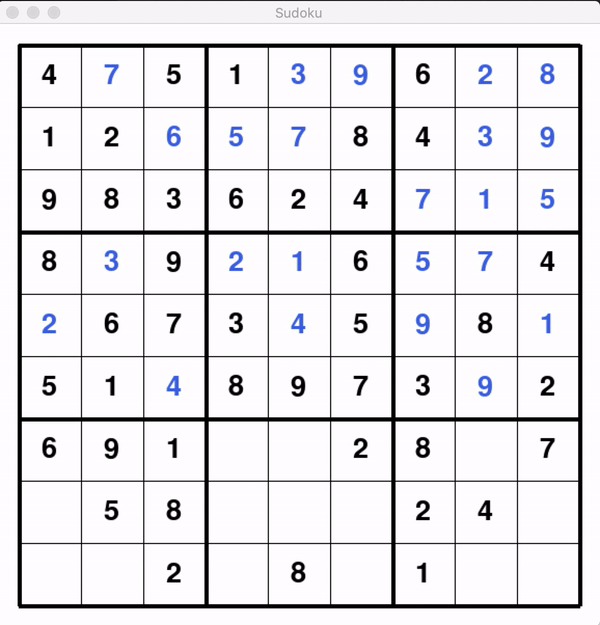

# Sudoku Solver and Visualizer
The script is able to solve a given Sudoku and/or visualize the process of solving it using Pygame. A backtracking algorithm is used to find the solution.

### Load Sudoku
```python
from board import Board

board = Board("sudokus/board1.txt") # Load board from textfile
board = Board("resources/sudoku_hard.jpg") # Load board from image
board = Board("webcam") # Scan board using webcam (click 's' to take photo and 'q to quit)
board = Board([
   [4, 0, 5, 1, 0, 0, 6, 0, 0],
   ...
   [0, 0, 2, 0, 8, 0, 1, 0, 0]
]) # load from 2D-array

```

### Solve Sudoku
```python
# Solve without animation
solver = Solver(board)
solver.solve()
board.print() # outputs solved board to console

```

### Visualize Solving Process
```python
from gui import main_gui

main_gui(board) # start visualizing process
```


